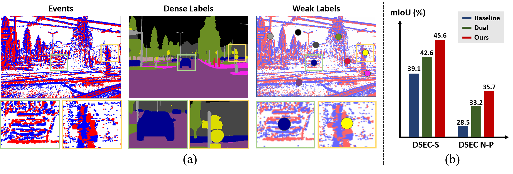

# Finding Meaning in Points: Weakly Supervised Semantic Segmentation for Event Cameras (ECCV2024)
<p align="center">
 
</p>

Official code for **Finding Meaning in Points: Weakly Supervised Semantic Segmentation for Event Cameras** (ECCV2024)
([Paper](https://arxiv.org/pdf/2407.11216v1))


```bibtex
@Article{cho24eccv,
  author  = {Hoonhee Cho* and Sung-Hoon Yoon* and Hyeokjun Kweon* and Kuk-Jin Yoon},
  title   = {Finding Meaning in Points: Weakly Supervised Semantic Segmentation for Event Cameras},
  journal = {European Conference on Computer Vision. (ECCV)},
  year    = {2024},
}
```


## Abstract
Event cameras excel in capturing high-contrast scenes and dynamic objects, offering a significant advantage over traditional frame-based cameras. Despite active research into leveraging event cameras for semantic segmentation, generating pixel-wise dense semantic maps for such challenging scenarios remains labor-intensive. As a remedy, we present EV-WSSS: a novel weakly supervised approach for event-based semantic segmentation that utilizes sparse point annotations. To fully leverage the temporal characteristics of event data, the proposed framework performs asymmetric dual-student learning between 1) the original forward event data and 2) the longer reversed event data, which contain complementary information from the past and the future, respectively. Besides, to mitigate the challenges posed by sparse supervision, we propose feature-level contrastive learning based on class-wise prototypes, carefully aggregated at both spatial region and sample levels. Additionally, we further excavate the potential of our dual-student learning model by exchanging prototypes between the two learning paths, thereby harnessing their complementary strengths. With extensive experiments on various datasets, including DSEC Night-Point with sparse point annotations newly provided by this paper, the proposed method achieves substantial segmentation results even without relying on pixel-level dense ground truths.

## Installation

If desired, a conda environment can be created using the followig command:
```bash
conda create -n <env_name>
```
As an initial step, the wheel package needs to be installed with the following command:
```bash
pip install wheel
```
The required python packages are listed in the `requirements.txt` file.
```bash
pip install -r requirements.txt
```

## Datasets
### DDD17
we used a pre-processed DDD17 dataset with semantic labels [here](https://download.ifi.uzh.ch/rpg/ESS/ddd17_seg.tar.gz). Please do not forget to cite [DDD17](https://sensors.ini.uzh.ch/news_page/DDD17.html) and [Ev-SegNet](https://github.com/Shathe/Ev-SegNet) if you are using the DDD17 with semantic labels.
The weak labels used by our works can be downloaded [Link](https://drive.google.com/drive/folders/1xP-5F4Q5I6Vgi6ITeKHkzDXRtn-5Nkn0?usp=drive_link).

```
The DDD17 dataset should have the following format:
    ├── ddd17                 
    │   ├── dir0               
    │   │   ├── event.data.t
    │   │   ├── events.dat.xyp
    │   │   ├── imgs
    │   │   ├── index
    │   │   ├── segmentation_masks
    │   │   ├── weak_1point_per_class
    │   │   └── weak_10point_per_class
    │   └── dir1
    │       ├── event.data.t
    │       └── ... 
```

### DSEC
The DSEC-Semantic dataset can be downloaded [here](https://dsec.ifi.uzh.ch/dsec-semantic/). Please do not forget to cite [DSEC](https://github.com/uzh-rpg/DSEC) and [ESS](https://github.com/uzh-rpg/ess) if you are using the DSEC with semantic labels.
The weak labels used by our works can be downloaded [Link](https://drive.google.com/drive/folders/1VuO1RSvN8bpGli0vSGoET_Md0kWW-fdO?usp=drive_link).

```
The DSEC dataset should have the following format:
    ├── DSEC_Semantic                 
    │   ├── train               
    │   │   ├── zurich_city_00_a
    │   │   │   │   ├── left
    │   │   │   │   │ ├── events.h5
    │   │   │   │   │ ├── rectify_map.h5
    │   │   │   │   │ └── ev_inf
    │   │   │   │   ├── 11classes
    │   │   │   │   │     ├── 000000.png
    │   │   │   │   │     └── ...
    │   │   │   │   ├── 11classes_weak_1point_per_class
    │   │   │   │   │     ├── 000000.png
    │   │   │   │   │     └── ...    
    │   │   │   │   ├── 11classes_weak_10point_per_class
    │   │   │   │   │     ├── 000000.png
    │   │   │   │   │     └── ...    
    │   │   │   │   └── timestamps.txt
    │   │   └── ...
    │   └── test
    │       ├── zurich_city_13_a
    │       │        ├── left
    │       │        ├── 11classes
    │       └── ... 
```

### DSEC Night-Point
The DSEC NIght dataset can be downloaded [DSEC](https://github.com/uzh-rpg/DSEC) and [CMDA](https://github.com/XiaRho/CMDA). The weak labels used by our works can be downloaded [Link](https://drive.google.com/drive/folders/1pZujDG-LYpwwJT3zAgmUepwP-_tFhjA-?usp=drive_link).

```
The DSEC Night dataset should have the following format:
    ├── DSEC_Night              
    │      ├── zurich_city_09_a
    │      │   │   ├── events
    │      │   │   │ 
    │      │   │   ├── labels
    │      │   │   │     ├── ~~~.png
    │      │   │   │     └── ...
    │      │   │   ├── labels_test
    │      │   │   │     ├── ~~~.png
    │      │   │   │     └── ...    
    │      │   │   ├── warp_images
    │      │   │   │     ├── 000000.png
    │      │   │   │     └── ...    
    │      │   │   └── timestamps.txt
    │      └── ...
```

For the 'labels_test' directory, we used dense labels provided by [CMDA](https://github.com/XiaRho/CMDA) for testing purposes, while 'labels' refers to the weak labels that we provide.


Generating a voxel grid during the training process within the dataloader can lead to CPU overload. Therefore, for the DSEC dataset, we pre-generated and saved the voxel grids in advance.
This can be done using the provided code in the processing directory with the following command:
```bash
python processing/voxel_generate.py --dataset_path $DSEC_DATASET_PATH$
python processing/voxel_generate_night.py --dataset_path $DSEC_NIGHT_DATASET_PATH$
```


## Training
The settings for the training can be specified in `config/settings_XXXX.yaml`.

The following command starts the training:
```bash
CUDA_VISIBLE_DEVICES=<GPU_ID> python train.py --settings_file config/settings_XXXX.yaml
```

For example, weak settings for DSEC dataset can be trained as:
```bash
CUDA_VISIBLE_DEVICES=0 python train.py --settings_file config/settings_DSEC.yaml
```


# Acknowledgement
Several network architectures were adapted from:

https://github.com/uzh-rpg/rpg_e2vid

https://github.com/uzh-rpg/ess


The DSEC data loader was adapted from:

https://github.com/uzh-rpg/DSEC


